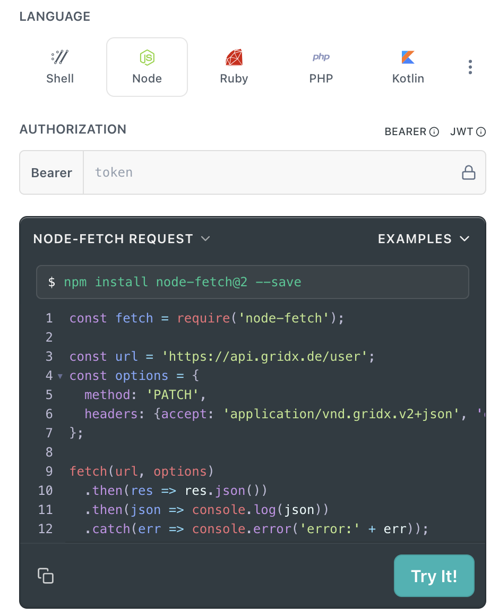
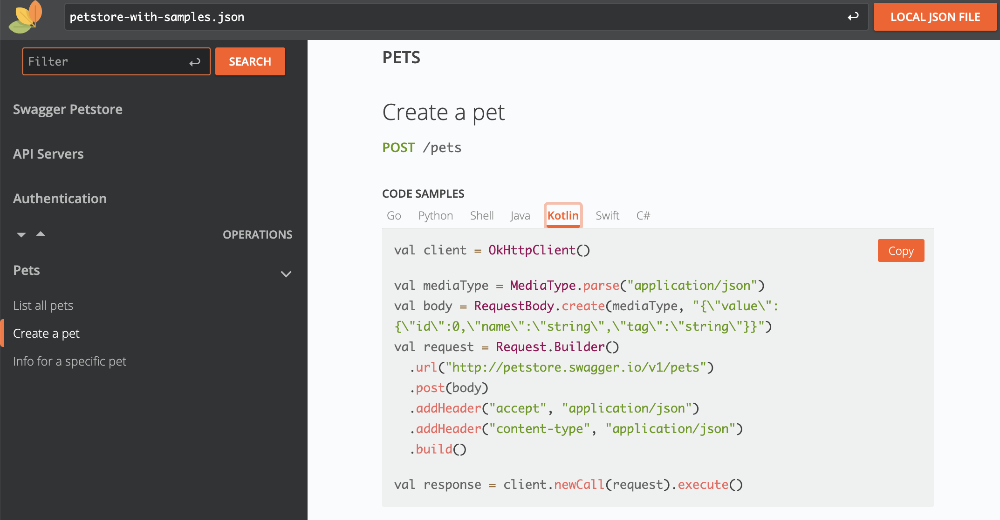
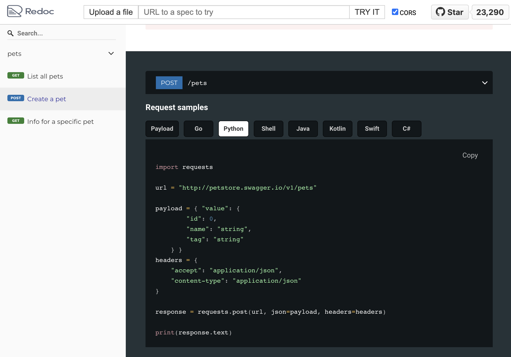

# Generate Code Snippets from an OpenAPI specification

This GitHub Action takes an OpenAPI spec, generates code samples for each
operation and adds them to the spec using
[the `x-code-samples` extension](https://redocly.com/docs/api-reference-docs/specification-extensions/x-code-samples).

If you
[specified `examples` in your endpoint](https://swagger.io/docs/specification/adding-examples/),
it takes the first example as the payload when generating snippets. If there is
no example, the payload will be empty/`null`.

The following languages are supported:

- c
- clojure
- csharp
- go
- http
- java
- javascript
- json
- kotlin
- node
- cplusplus
- objectivec
- ocaml
- php
- powershell
- python
- r
- ruby
- shell
- swift

The results look like this.

 _readme.com_

 _RapiDoc_

 _Redoc_

## Prerequisites / Inputs

- `spec_file` - The OAS file to add code samples to
- `out_file` - Where to store the augmented OAS JSON
- `languages`- Comma-separated list of languages for which to generate code
  samples. Defaults to "go, python, shell, java, kotlin, swift"

## Instructions

Add a GitHub Action in your workflow, passing the input spec file (json or
yaml), the desired output file location (json) and, optionally, the list of
languages to generate snippets for.

```yaml
- name: Generate Code Samples
  uses: grid-x/api-spec-snippets-generator-action@v6
  with:
    spec_file: ./petstore.yaml
    out_file: ./petstore-with-samples.json
    languages: go,python,shell,java,kotlin,swift,csharp
```

## Development

- You can run the action locally using `npm run test:run`, providing the
  configuration parameters through the environment. See
  [test.ts](./src/test.ts).
- See [package.json](./package.json) for linting, testing and formatting
  scripts.
